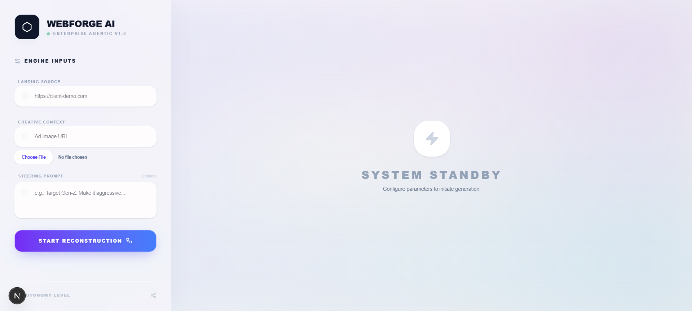
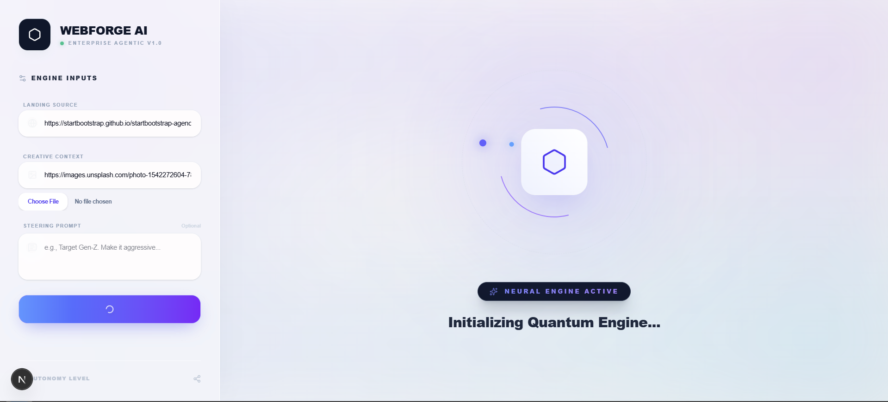
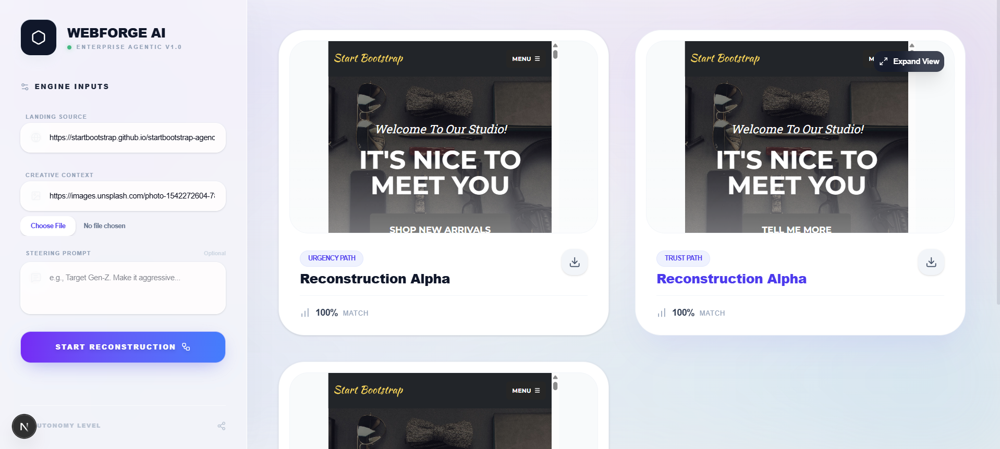

<div align="center">

# ⚡ WEBFORDGE AI
**Autonomous Agentic Conversion Rate Optimization (CRO)**

[](https://nextjs.org/)
[](https://fastapi.tiangolo.com/)
[](https://python.org)
[](https://ai.google.dev/)
[](https://python.langchain.com/)

An enterprise-grade, multi-agent AI system that autonomously reconstructs target landing pages to perfectly align with specific ad campaigns, generating A/B/C variants in real-time while preserving 100% of the original CSS layout.

---



</div>

## 🧠 The Problem & The Troopod Solution
Standard LLMs suffer from "Output Truncation" and "Laziness" when asked to rewrite raw HTML. They hallucinate DOM structures, destroy CSS grids, and fail to replace deep nested elements. 

**Troopod Engine solves this using a proprietary Deep DOM Tracking algorithm.** Instead of feeding raw HTML to an LLM, Troopod parses the DOM, injects invisible `data-tpd-id` tracking nodes, extracts pure JSON assets (text & images), and uses LangChain Pydantic schemas to force the LLM to return strict 1:1 translations. The backend then natively re-injects the AI's logic back into the HTML blueprint, ensuring zero layout breakage.

## 🚀 Key Architectural Features
* **Agentic Multimodal Workflow:** Uses LangGraph to orchestrate a Vision Agent (extracting context from ad creatives) and a Copywriter Agent (rewriting DOM assets).
* **Deep DOM Replacement:** Swaps both text nodes and `` URLs seamlessly using BeautifulSoup4.
* **Intelligent Visual Theming:** Dynamically extracts dominant hex codes from uploaded Ad Creatives and injects global `<style>` overwrites to theme CTAs and buttons.
* **Steering Prompts (L4 Autonomy):** Allows users to inject priority overriding instructions to guide the LLM's tone and target audience.
* **Cinematic Frontend UI:** Built on Next.js 16 with Tailwind v4, utilizing Framer Motion for "Quantum Core" loading states and Apple-style modal expansions.

---

## 🖥️ System Interface

### 1. The Processing Core
When an injection begins, the UI transitions to a highly visual, terminal-style loading state while the FastAPI backend orchestrates the LangGraph agents.
<div align="center">
  
</div>

### 2. Strategy Generation (Thumbnail View)
The system outputs three distinct psychological strategies: **Urgency**, **Trust**, and **Logical**. The iframes are rendered in a secure sandbox using isolated browser Blobs.
<div align="center">
  
</div>

### 3. Interactive Modal (Deep Dive)
Clicking a variant executes a Framer Motion layout shift, opening a fully interactive, scrollable iframe where users can inspect the AI's DOM manipulation and export the raw HTML.
<div align="center">
  
</div>

---

## ⚙️ Tech Stack & Infrastructure

| Category | Technology |
| :--- | :--- |
| **Frontend Core** | Next.js 16 (App Router, Turbopack), React 18 |
| **Styling & Motion** | Tailwind CSS v4, Framer Motion, Lucide React |
| **Backend API** | FastAPI, Uvicorn, Python 3.10+ |
| **AI / Orchestration** | LangGraph, LangChain, Google Gemini 3.1 |
| **DOM Parsing** | BeautifulSoup4 (bs4), lxml |

---

## 📂 Project Structure
```
troopod-conversion-engine/
├── backend/                        # FastAPI & Agentic Logic
│   ├── database/                   # Local Database Architecture
│   │   ├── db.py                   # Database Connection Logic
│   │   ├── schema.sql              # Table Definitions
│   │   └── troopod.db              # SQLite Database File
│   ├── images/                     # Documentation & README Assets
│   ├── services/                   # Microservices & LangGraph Nodes
│   │   ├── __init__.py
│   │   ├── copywriter_agent.py     # Pydantic Structured JSON Output
│   │   ├── html_builder.py         # Precise DOM Re-injection & CSS Theming
│   │   ├── qa_auditor.py           # Quality Assurance Evaluator Agent
│   │   ├── scraper.py              # DOM Tracker ID Injection
│   │   └── vision_agent.py         # Multimodal Ad Context Extraction
│   ├── uploads/                    # Temporary Storage for User Assets
│   │   └── .gitkeep
│   ├── .env                        # Environment Variables (Ignored in Git)
│   ├── check_models.py             # Validation & Testing Utilities
│   ├── main.py                     # API Endpoints & Core Job Router
│   ├── models.py                   # Pydantic Request/Response Models
│   └── requirements.txt            # Python Dependencies
│
└── frontend/                       # Next.js 16 Application
    ├── public/                     # Static Frontend Assets
    ├── src/
    │   ├── app/
    │   │   ├── globals.css         # Tailwind v4, Mesh Gradients & Animations
    │   │   ├── layout.js           # Next.js Application Shell
    │   │   └── page.js             # Main Dashboard, UI State & Polling
    │   ├── components/
    │   │   └── VariantCard.js      # Interactive Iframe Modal & Base Tag Injection
    │   └── lib/
    │       └── api.js              # Polling and Backend Communication
    ├── package.json                # Node Dependencies
    ├── postcss.config.mjs          # PostCSS Configuration
    └── tailwind.config.js          # Tailwind Configuration Rules
```

## ⚙️ System Initialization & Deployment

Ensure your local environment meets the following specifications before initializing the Troopod Engine:

*  Required for the Next.js Turbopack compiler.
*  Required for FastAPI and LangGraph asynchronous execution.
*  Required for the core multimodal reasoning layer.
</details>


## 🛠️ Installation & Execution

### Prerequisites
```
Node.js v18+

Python 3.10+

Google Gemini API Key
```

### Backend Setup (FastAPI)

Navigate to the backend directory:
```
cd backend
```
Create and activate a virtual environment:
```
python -m venv venv
source venv/bin/activate  # On Windows use: venv\Scripts\activate
```
Install dependencies:
```
pip install fastapi uvicorn beautifulsoup4 lxml langchain langchain-google-genai pydantic python-multipart
```
Set your environment variables (create a .env file):
```
GEMINI_API_KEY=your_api_key_here
```
Start the engine:
```
uvicorn main:app --reload
```
The backend will run on http://127.0.0.1:8000

### Frontend Setup (Next.js)

Open a new terminal and navigate to the frontend directory:
```
cd frontend
```
Install dependencies:
```
npm install
```
Start the Turbopack dev server:
```
npm run dev
```
The frontend will run on http://localhost:3000

## 🔭 Strategic Roadmap & Future Architecture

Our engineering pipeline is aggressively focused on scaling the engine's autonomy, visual parsing, and deployment capabilities for v2.0.

- **Phase 1: Headless CSS Parsing**
  > Upgrade the scraping engine to parse external `.css` stylesheets. This enables the Vision Agent to natively identify and selectively replace deep `background-image` SVGs, pseudo-elements, and complex CSS-bound visual assets without breaking layout.

- **Phase 2: Multi-Agent Debate Protocol**
  > Implement a dedicated `QA_Auditor` node within the LangGraph cyclic state. This secondary AI will mathematically critique the primary copywriter's generated JSON against the original HTML skeleton, autonomously rejecting structure-breaking hallucinations before the final render.

- **Phase 3: Edge-Native Direct Deploy**
  > Build native API pipelines to **Vercel** and **Netlify**. This allows the engine to instantly push newly generated variant blobs directly to a live, edge-cached staging environment with zero manual deployment.

- **Phase 4: Autonomous A/B Telemetry**
  > Inject custom analytic tracking tags and event listeners directly into the output HTML. This provides seamless, out-of-the-box conversion lift tracking to measure exact performance deltas between the generated *Urgency*, *Trust*, and *Logical* variants.

<div align="center">
<b>Architected & Engineered by</b>


Keshav Sharma | AI Engineer
</div>